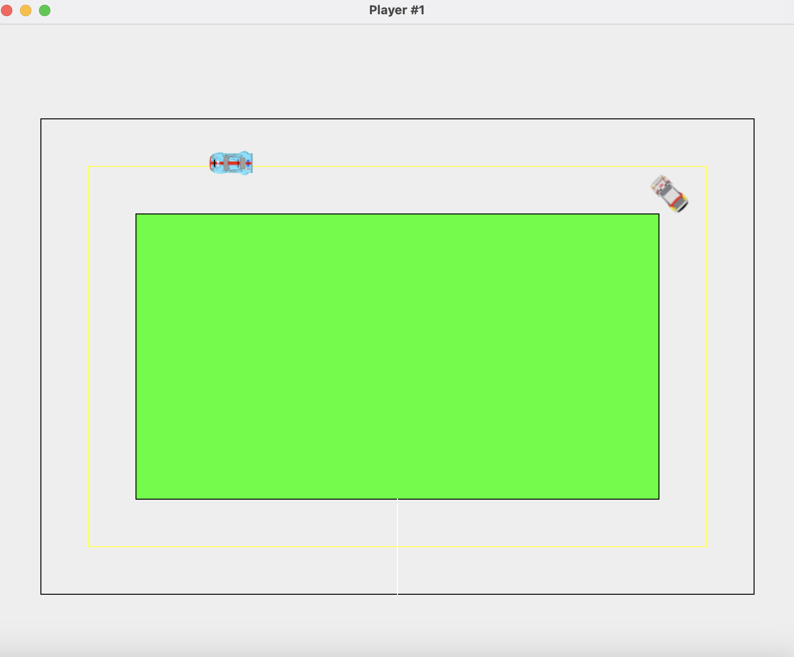
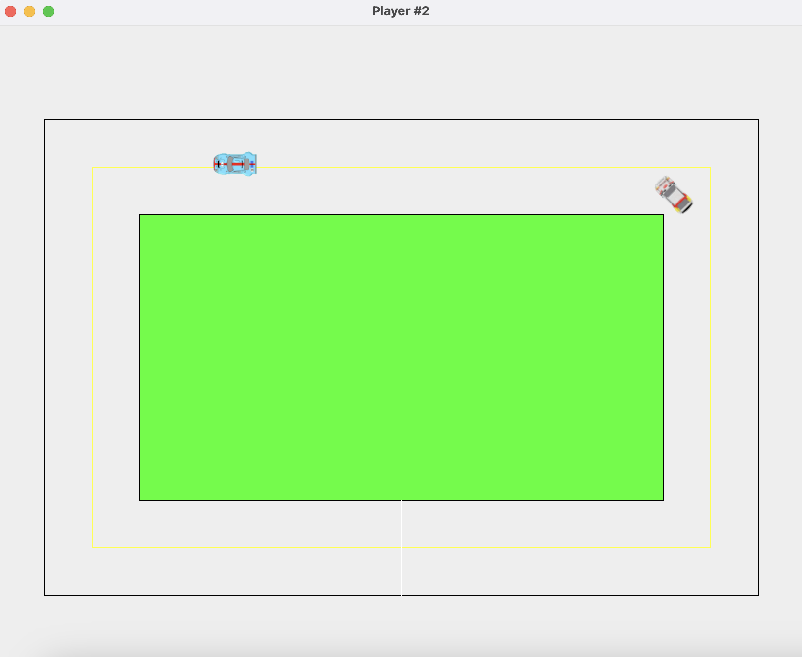
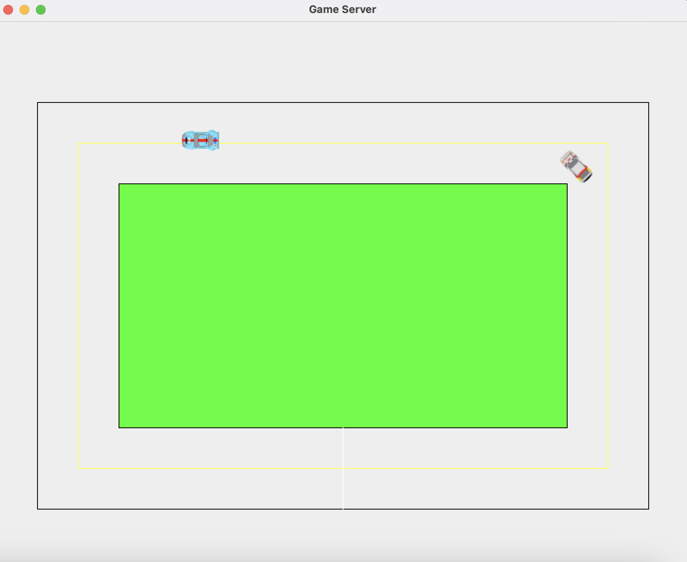

#  MULTI-PLAYER KART RACING GAME  🎮

### Welcome to the Shared.Kart Racing Shared.Game! 🏎️

In this multi-player game two players can compete against each other in go-karts.The goal is to finish each race as quickly and winning the game.
This document will provide information about the game.This game consists of 2 karts which are controlled by 4 sets of keys for each player.
The game was tested on a single computer, three configurations were created for each component, 2 clients and 1 server.

## Features 🧩
- **Multi-player game:** The karts compete against another kart. The kart moved by a player moves for the other player and a server game window as well.
- **Client-server communication:** The client kart updates are sent to the server, the server updates the kart in it's own window and sends the update to the other client. The other client can move it's own kart using their own set of 4 keys and second kart update received from the other client is also repainted in their own game window. 
- **Karts colliding with Racetrack:** When the karts hit the inner,outer racetrack the speed of the kart is set to zero.
- **Karts colliding with each other:** When the karts collide into each other, the speed is set to zero. 
- **Moving Karts:** The karts have been assigned keyboard keys to increase or decrease kart speed. There are keys to turn the kart left or right as well by 22.5 degrees.

 

|        **Player1(Blue Shared.Kart)**        |       **Player2(White Shared.Kart)**        |
|:------------------------------------:|:------------------------------------:|
|  |  |
|           **Shared.Game Server**            |                      |
|   | 

## Built using 🔨
- Netbeans IDE 17.0.6+10-b829.5 aarch64
- JDK 20.0.1

## How to Play 🕹️
### Controls 🎮

|White Shared.Kart| Blue Shared.Kart| Description|  
|:----------:|:----------:|:----------:| 
|W|⬆|FORWARD|  
|A|⬅|ROTATE LEFT by 22.5°|  
|D|➡|ROTATE RIGHT by 22.5°|  
|S|⬇|BACKWARD|  

### Getting Started✅
#### Setting Up
1. Create a new project
2. Include the source files inside the `src` directory
3. Start the server first by running src/GameFrame.java ⚙
4. Edit Run/Debug configurations > click the top left "+" button saying Add new configuration > add 3 new application configuration
5. Name the kart "Blue kart", Add "Player.PlayerServer" as class, "BlueKart" as a parameter
5. Second configuration, "White kart", Add "Player.PlayerServer" as class, "WhiteKart" as a parameter
5. Third configuration, "Shared.Game Server", Add "Player.PlayerServer" as class. 
6. First run the Shared.Game Server, then after two client configurations are run all the windows will appear as seen in the above table of images.  
4. Start Playing! 👾

